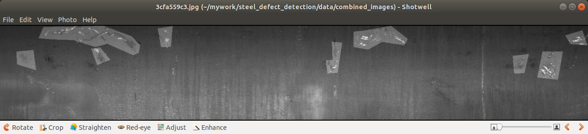

# steel defect detection devnotes

## data preperation

### mask convert & generation

convert the run-length csv annotation file into an gray-scale image, and combined the two images for debugging:

## test the deep-learning algorithms

based on reviewing the combined images, it seems semantic segmentation is a good choice for this kind of application.

### Plan

first, use deeplabv3+ for baseline

and another option is SegDec-JIM2019

#### deeplabv3+ 

use pytorch-template the generate the template , and the use the predefined deeplabv3+ network inside torch-vision for testing.

#### SegDec-net-JIM2019

